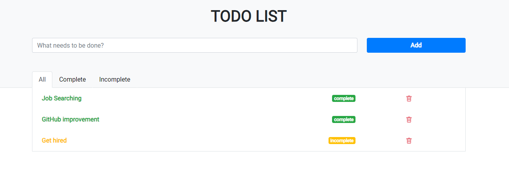

# Todo-list_React
 
## About the Project
This To-Do List app, built with React, reflects my growth in web development. It's a project created in <Code_for_all> Reactor Program that highlights my ability to integrate front-end and back-end elements effectively.

### Built With
- **React.js**

## Features
- **Task Management**: Add, delete, and mark tasks as complete with ease.
- **Responsive Design**: Accessible on various devices and screen sizes.

## Demo
Here's a live Demo of this project:
[To-Do List](https://todo-list-react-nine-navy.vercel.app/)

